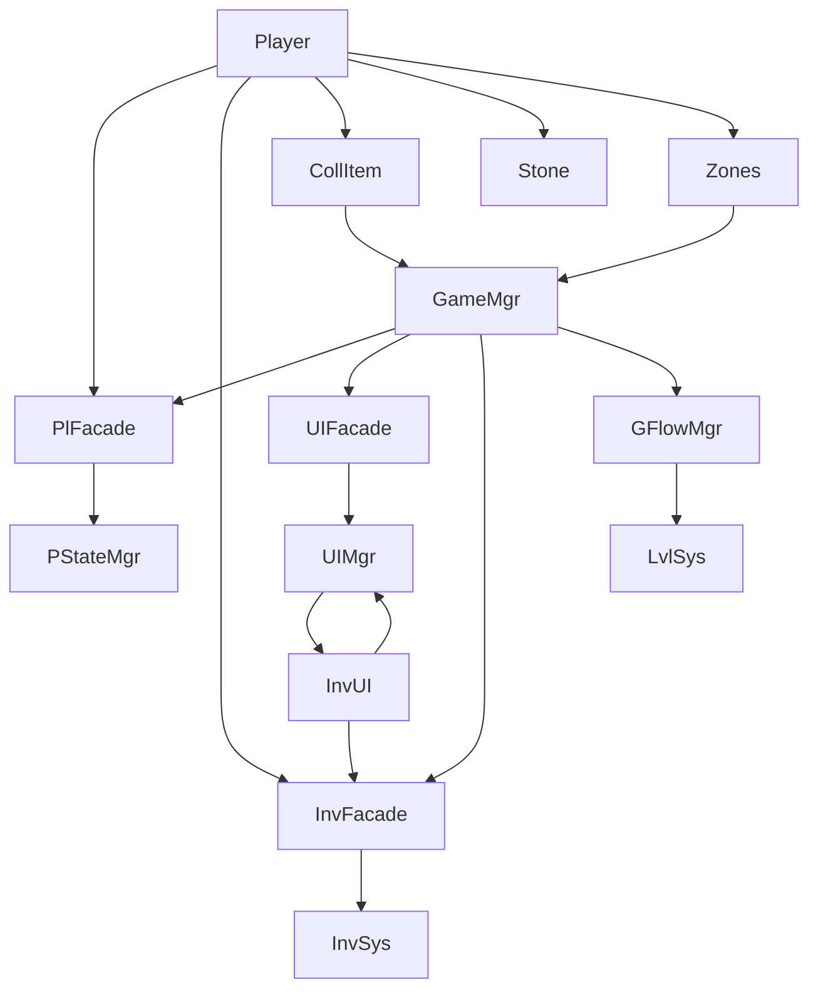
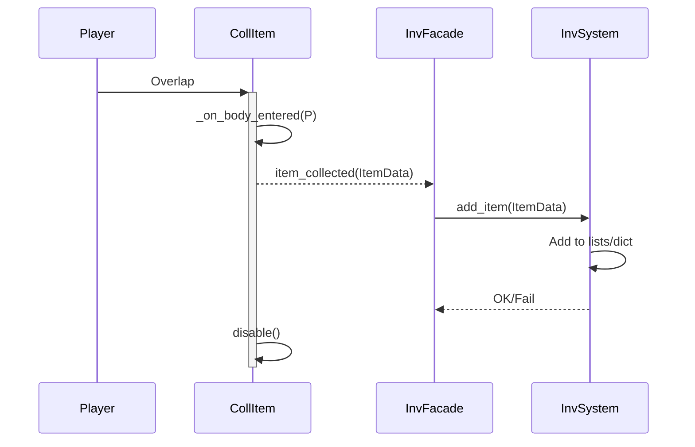
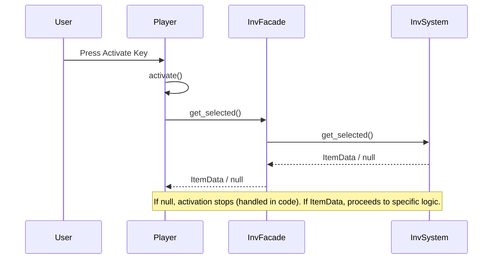
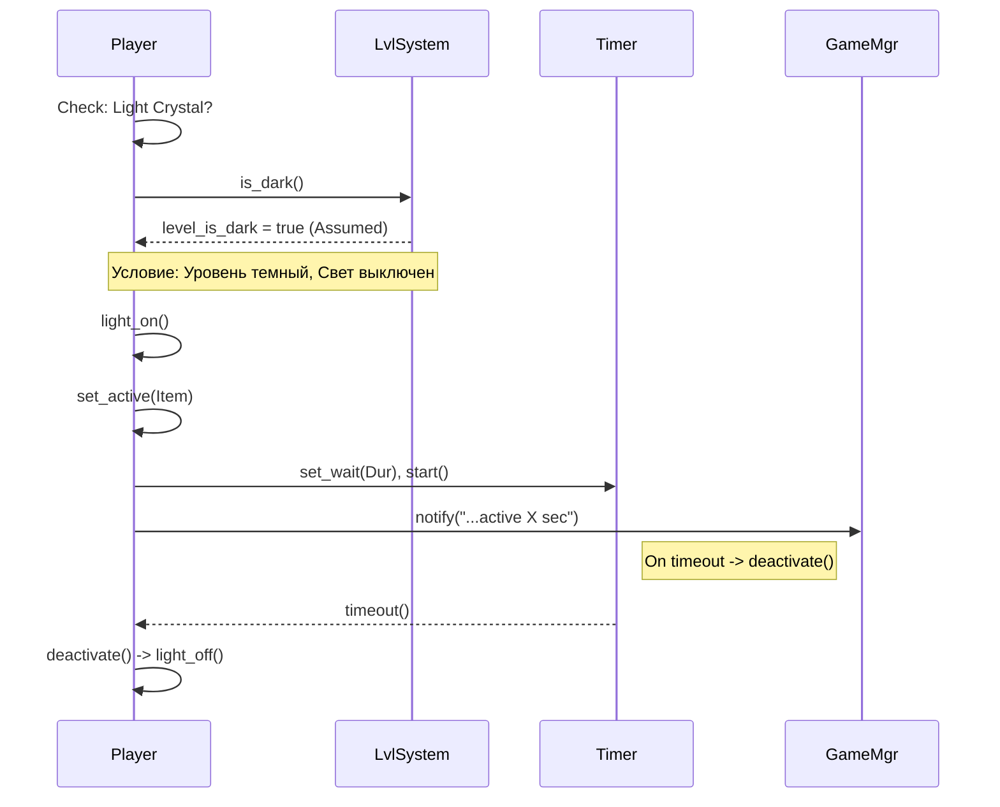
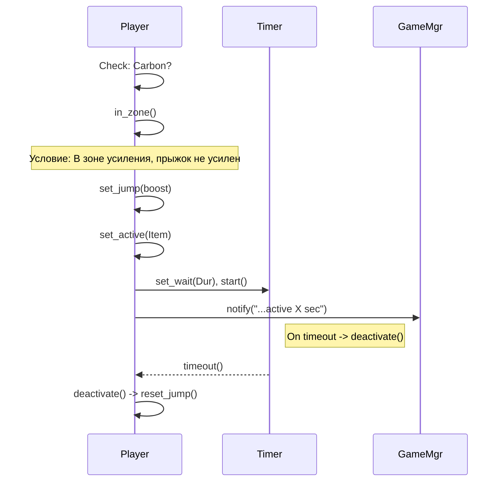
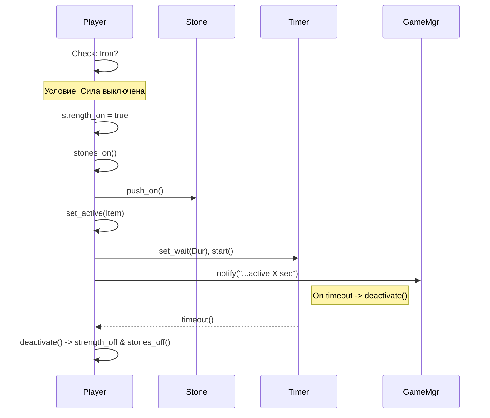

**Обзор Архитектуры и Взаимодействия Компонентов**

В основе игры лежит модульная архитектура, где различные подсистемы отвечают за свои аспекты игры. Центральный узел `GameManager` выступает как координатор, инициализируя и связывая эти системы, но не содержит в себе всей игровой логики. Для организации взаимодействия используются **Фасады** (`PlayerFacade`, `InventoryFacade`, `UIFacade`, `GameFlowManager`) – они предоставляют упрощенный и контролируемый интерфейс к более сложным базовым системам (`PlayerStateManager`, `InventorySystem`, `UIManager`, `LevelSystem`). Это позволяет разным частям игры общаться друг с другом, не создавая жестких прямых зависимостей.

**Схема Взаимодействия Компонентов:**

*Пояснение: Эта схема показывает общую архитектуру. `GameManager` координирует Фасады (`PlayerFacade`, `UIFacade`, `InventoryFacade`, `GameFlowManager`). Фасады предоставляют интерфейс к Базовым Системам (`PlayerStateManager`, `UIManager`, `InventorySystem`, `LevelSystem`). Игрок (`Player`) и другие игровые объекты (`CollectibleItem`, `Stone`, `JumpBoostZone/KillZone`, `InventoryUI`) взаимодействуют с Фасадами или напрямую с `GameManager`.* 

**Ключевые Компоненты:**

*   **Базовые Системы:** `PlayerStateManager`, `InventorySystem`, `UIManager`, `LevelSystem`.
*   **Фасады:** `PlayerFacade`, `InventoryFacade`, `UIFacade`, `GameFlowManager`.
*   **Игровые Объекты (Сцены/Скрипты):** `Player`, `CollectibleItem`, `Stone`, `JumpBoostZone`, `KillZone`, `LevelExit`, `Portal`, `Professor`, `Slime`, `InventoryUI`, и т.д.

**Базовые Механики Игрока (`player.gd`)**

Игрок (`CharacterBody2D`) управляет движением, анимациями (`AnimatedSprite2D`), обнаружением столкновений (`move_and_slide`) и инициирует большинство взаимодействий.

**Механика Подбора Предметов**

Эта схема показывает, как предмет попадает в инвентарь игрока:

*Пояснение: Диаграмма иллюстрирует упрощенный процесс подбора предмета. Игрок (`P`) пересекается с Предметом (`CI`). Предмет посылает сигнал Фасаду Инвентаря (`IF`), который передает команду Системе Инвентаря (`IS`) добавить предмет. После добавления Предмет отключается (`disable`).*

**Механика Ручной Активации Способностей (Кристаллы)**

Активация способностей происходит вручную по нажатию клавиши и зависит от выбранного в инвентаре предмета и контекста игры (темнота уровня, нахождение в особой зоне и т.д.). Процесс включает несколько систем.

**1. Общий Поток Активации (От нажатия до получения предмета):**

*Пояснение: Начальный этап активации. Пользователь (`User`) нажимает клавишу. Игрок (`P`) запрашивает выбранный предмет у Фасада Инвентаря (`IF`), который обращается к Системе Инвентаря (`IS`). Результат (данные предмета `ItemData` или `null`) возвращается Игроку. Дальнейшая логика зависит от результата.* 

**2. Пример: Активация Светящегося Кристалла:**

Если выбран Светящийся кристалл, проверяется, является ли уровень темным. Диаграмма ниже показывает основной сценарий активации временного эффекта.

*Пояснение: Упрощенная логика Светящегося Кристалла (основной сценарий). Игрок (`P`) проверяет, что уровень темный (`is_dark`). Если да (и свет выключен), Игрок включает свет (`light_on`), регистрирует активный предмет и запускает Таймер. По истечении времени Таймер вызывает деактивацию света. Случаи, когда уровень светлый или свет уже включен, здесь не показаны для простоты.* 

**3. Пример: Активация Углерода (Усиление Прыжка):**

Если выбран Углерод, проверяется нахождение игрока в зоне усиления. Диаграмма ниже показывает основной сценарий активации временного эффекта.

*Пояснение: Упрощенная логика кристалла Углерода (основной сценарий). Игрок (`P`) проверяет, что он в зоне усиления (`in_zone`). Если да (и прыжок не усилен), Игрок усиливает прыжок (`set_jump`), регистрирует активный предмет и запускает Таймер. По истечении времени Таймер вызывает сброс прыжка (`reset_jump`). Случаи, когда игрок не в зоне или прыжок уже усилен, здесь не показаны.* 

**4. Пример: Активация Железа (Усиление Силы):**

Если выбрано Железо, включается флаг силы и обновляются камни. Диаграмма ниже показывает основной сценарий активации временного эффекта.

*Пояснение: Упрощенная логика кристалла Железа (основной сценарий). Игрок (`P`) активирует силу (`strength_on`), делает ближайшие Камни (`Stone`) толкаемыми (`push_on`), регистрирует активный предмет и запускает Таймер. По истечении времени Таймер вызывает отключение силы и возврат камней в исходное состояние. Случай, когда сила уже активна, здесь не показан.* 

**Механика Толкания Камней**

Эта механика иллюстрирует, как активированная способность игрока влияет на другие объекты:

1.  **Активация Силы:** Игрок активирует Кристалл Железа. `player.gd` устанавливает флаг `is_strength_boost_active = true`.
2.  **Обновление Камней:** `player.gd` немедленно вызывает `_toggle_nearby_stones_pushable(true)`, который находит все камни и вызывает у них метод `set_pushable(true)`.
3.  **Изменение Камня:** `stone.gd` в методе `set_pushable(true)` устанавливает свой флаг `can_be_pushed = true` и уменьшает трение.
4.  **Толкание:** При физическом контакте игрока с камнем, `player.gd` проверяет `collider.can_be_pushed`. Если `true`, игрок применяет силу (`apply_central_impulse`).
5.  **Деактивация Силы:** По таймеру или при активации другой способности, `player.gd` устанавливает `is_strength_boost_active = false` и вызывает `_toggle_nearby_stones_pushable(false)`, возвращая камни в исходное состояние.

**Прочие Механики и Системы**

*   **Урон и Смерть:** Зоны `KillZone` (`Area2D`) при пересечении с игроком вызывают потерю жизни через `PlayerFacade` -> `PlayerStateManager`.
*   **Переходы между Уровнями:** Инициируются `LevelExit`, управляются `GameFlowManager` и `LevelSystem`.
*   **Коллизии:** Используются стандартные механизмы Godot (`CollisionShape2D`, слои/маски, `Area2D` сигналы, `move_and_slide`).
